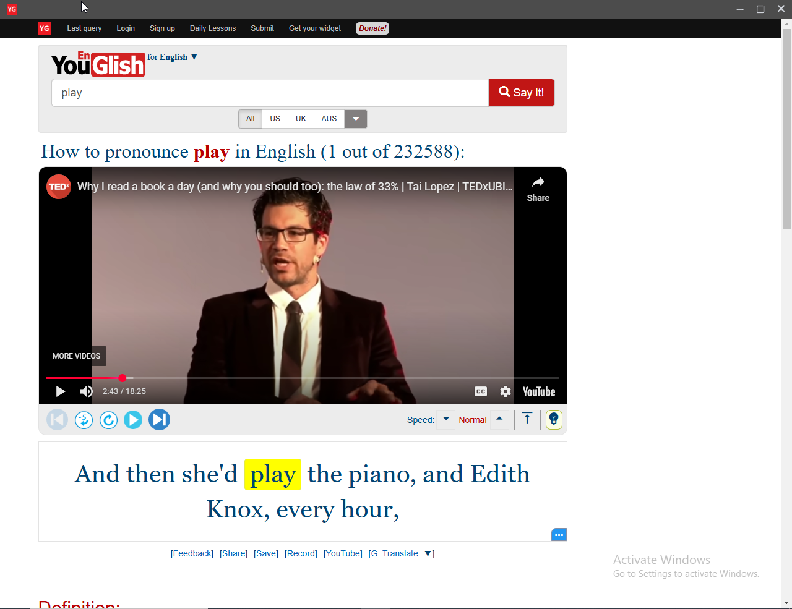

# Youglish Preview (Ad-Free & Private)

A simple Electron app that previews the [Youglish](https://youglish.com) website **without ads** and **without YouTube tracking your history**.

## ✨ Features

- 🔇 Ad-free Youglish experience
- 🕵️‍♂️ Incognito mode – YouTube can’t track your history
- ⚡ Built with Electron, React, and TailwindCSS
- 🧼 Minimal, clean interface

## 🔧 Technologies Used

- [Electron](https://www.electronjs.org/)
- [React](https://reactjs.org/)
- [TailwindCSS](https://tailwindcss.com/)


## Project Setup

### Install

```bash
$ npm install
```

### Development

```bash
$ npm run dev
```

### Build

```bash
# For windows
$ npm run build:win

# For macOS
$ npm run build:mac

# For Linux
$ npm run build:linux
```
